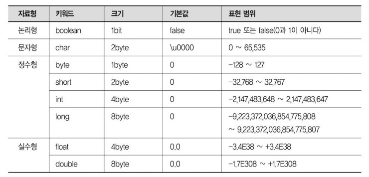

# 자바의 자료형


자바의 자료형은 크게 두 가지로 구분된다.

첫째, 기본 자료형(Primitive Data Type)이다.

둘째, 참조 자료형(Referenced Data Type)이다.


**정수형은 int, 실수형은 double이 기본 자료형이다.**
　

　


　




　


### 기본 자료형(Primitive Data Type)
- 숫자(정수, 실수)와 문자인 char 자료형과 논리형으로 구성되어 있다.
- 스택 영역에 생성되고 실제 값을 변수에 저장한다.
- 실수 자료형이 정수형보다 크다.
- float 자료형의 값에는 F(또는 f) 접미사를 붙여야 한다.예) 3.14f, 3.14F
- double 자료형도 명시할 경우 D(또는 d) 접미사를 붙일 수 있으나, 기본 실수형이므로 생략 가능하다.
- long 자료형 값에는 L(또는 l) 접미사를 붙여야 하나, 정수형 중에 가장 큰 자료형이므로 자동 형변환이 되어 생략 가능하다.


　

　


### 참조 자료형(Referenced Data Type)
- 객체(Object)의 번지를 참조하는 타입으로 배열, 열거, 클래스, 인터페이스 타입이 있다.
- 메모리의 번지(주소)를 값으로 갖는다.
- 참조 변수는 스택(Stack)영역에 생성되고 객체의 값을 가진 힙 영역의 주소가 저장된다.
- null 값을 가지면 주소를 참조하는게 아니라 null 값을 가지는 것, 힙 영역에 참조할 값들은 쓰레기(Garbage)가 되어 Garbage Collector가 처리하여 메모리를 확보한다.

　

**선언**  
* new 연산자 = 참조타입의 값을 힙(heap)메모리에 생성
```
자료형 변수명(참조변수명) = new 초기화;


int x = 3; double pi = 3.14; // 정수와 실수형 변수를 선언하고 값을 대입하여 초기화.

int x = getNumber(); // 정수형을 반환하는 임의의 함수인 getNumber()로부터 값을 받아 대입하여 초기화.

x = 4; // 스택 영역에 생성되어 있는 x의 값에 새로운 값인 4를 대입

Date today = new Date(); // Date 참조 자료형의 객체인 today 변수 선언 후, new 연산자로 Date() 객체로 초기화.
```


